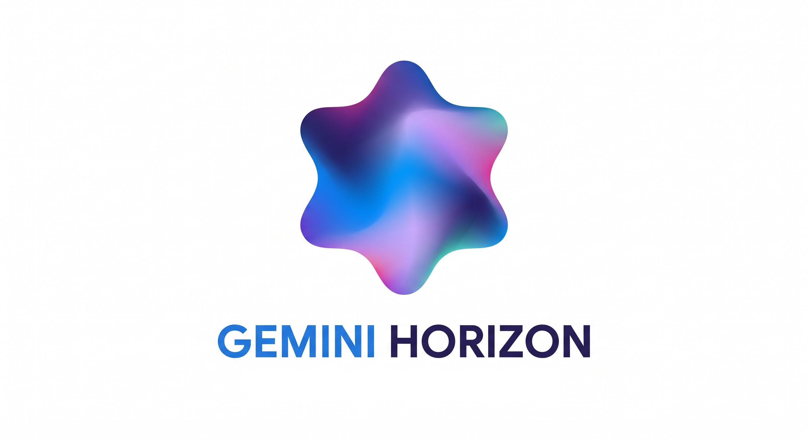

# 🌌 Gemini Horizon

<p align="center">
  
  <br>
  <b>Experience Google Gemini without limits.</b>
  <br>
  <i>Expands conversations and tables to the full width of your browser for a true widescreen AI experience.</i>
</p>

<p align="center">
  
  
  
</p>

---

## ✨ Features

- 🚀 **Full-Width Conversations**: Removes the restrictive `max-width` on chat containers, allowing for a more immersive experience.
- 📊 **Expansive Tables**: No more horizontal scrolling in small boxes—tables now span the full width of your viewport.
- 🔘 **In-Page Toggle**: A sleek, native-feeling toggle button injected directly into the Gemini interface.
- 🎯 **Smart Redirect**: Click the extension icon to instantly focus your active Gemini tab or open a new one.
- ⚡ **Lightweight & Fast**: Zero bloat, minified production code, and optimized CSS injection.

## 🛠️ Installation

### Manual Installation (Developer Mode)

1. **Clone or Download**: Save this repository to your local machine.
2. **Install Dependencies**:
   ```bash
   npm install
   ```
3. **Build the Project**:
   ```bash
   npm run build
   ```
4. **Load in Chrome**:
   - Open Chrome and navigate to `chrome://extensions`.
   - Enable **Developer mode** using the toggle in the top-right corner.
   - Click **Load unpacked**.
   - Select the `dist` folder generated by the build script.

## ⚖️ Disclaimer & Warning

> [!WARNING]
> **Not Official**: This project is not intended to be an official Chrome Extension and will not be published to the Chrome Web Store.

> [!IMPORTANT]
> **No Warranty**: There is no warranty that this extension will continue to work in the future if Google Gemini updates its UI or DOM structure.

> [!NOTE]
> **Unmaintained**: This project has no active maintainer and is provided as-is for educational and personal use.

## 🧪 Development

### Available Scripts

- `npm run build`: Cleans `dist/`, copies source files, and minifies JS/HTML for production.
- `npm run test`: Executes the Jest test suite with a 90% coverage threshold requirement.
- `npm run generate-icons`: Automatically generates all required icon sizes from `src/assets/logo.png`.
- `npm run minify`: Manually triggers the minification process for the `dist/` folder.

### Project Structure

- `src/content.js`: The heart of the extension—handles style injection and UI components.
- `src/background.js`: Service worker handling the extension action and tab management.
- `test/`: Comprehensive test suite to ensure stability across updates.

---

<p align="center">
  Made with ❤️ for the Gemini community.
</p>
